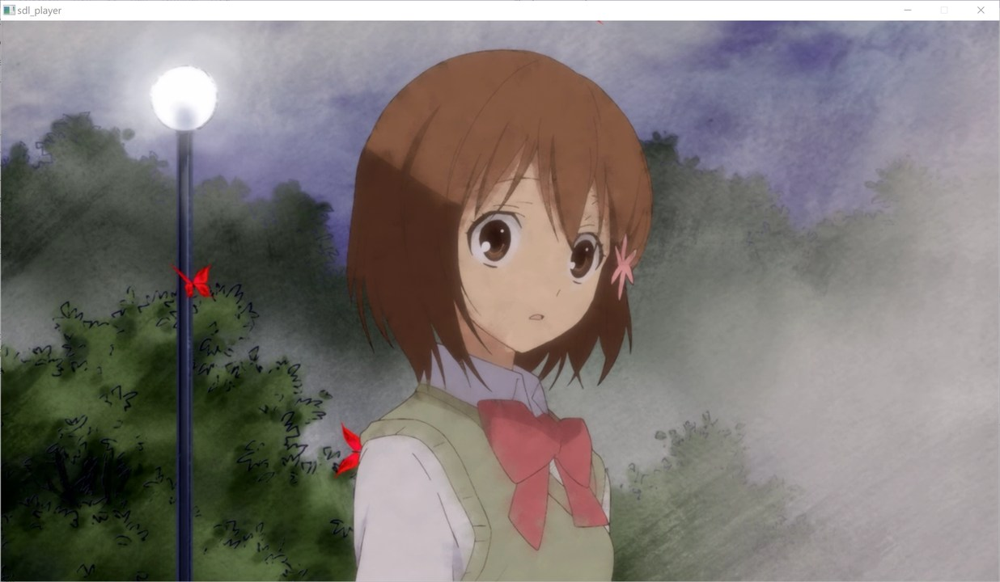

# SDL Player

This is a simple video/audio syncronized player, showing how to use ffmpeg.  

  

## Build  

- Windows Mingw64 (msys2)
See `local_mingw64.sh` in detail, must use msys2 shell to compile ffmpeg.  

``` shell
pacman -Syu --noconfirm
pacman -S --noconfirm make tar vim curl wget
pacman -S --noconfirm mingw-w64-x86_64-binutils mingw-w64-x86_64-gcc mingw-w64-x86_64-gdb
cd script && sh ./local_mingw64.sh
```

- Linux Mingw64
Some problems for building ffmpeg.  

``` shell
sudo apt-get -y update 
sudo apt-get -y install make tar vim curl wget
sudo apt-get -y install mingw-w64
cd script && bash -c "export SKIP_PORTS=yes && ./local_mingw64.sh"
```

- Linux x64
See `local_linux64.sh` in detail.  

``` shell
sudo apt-get -y update 
sudo apt-get -y install make tar vim curl wget
sudo apt-get -y install build-essential
cd script && bash ./local_linux64.sh
```

## Usage

Drag or use command `sdl_player xxx.mp4`  
(Also use `sh -c "script/run_mingw64.sh xxx.mp4"` if not copying required ffmpeg dll to the target)

Press `SPACE` to pause  
Press `R` to restart  
Press `ESC` to quit  
